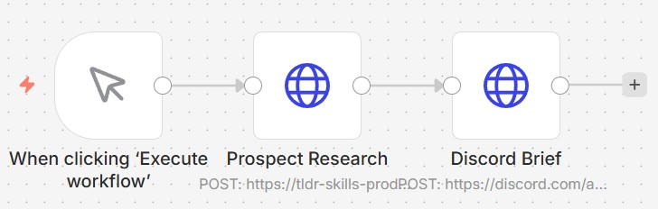
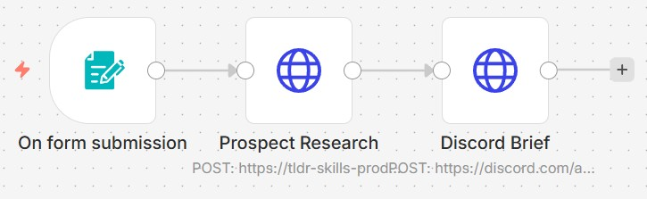
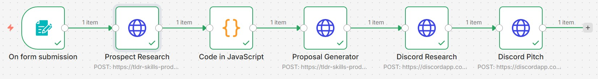

## n8n Integration

The TLDR sales skills are designed to work as HTTP nodes in any n8n workflow.
Three workflows are included as examples:

**Workflow 1 — Manual Trigger**
When clicking 'Execute workflow' → POST to /skill/research → POST brief to Discord.
For one-off research runs without a form.

**Workflow 2 — Form Trigger**
On form submission → POST to /skill/research → POST brief to Discord.
Anyone fills out a form with a company name and gets a full brief posted to Discord automatically. No API key needed for the user, no code, no engineering tickets.

**Workflow 3 — Full Proposal Pipeline**
On form submission → POST to /skill/research → Code node extracts prospect brief → POST to /skill/proposal → POST proposal to Discord.
End-to-end pipeline: a sales rep fills out the form, the research skill generates a prospect brief, a Code node reshapes the output, the proposal skill generates a full pitch, and the final proposal posts to Discord.

The skills have no idea n8n is calling them. Any HTTP client works.
